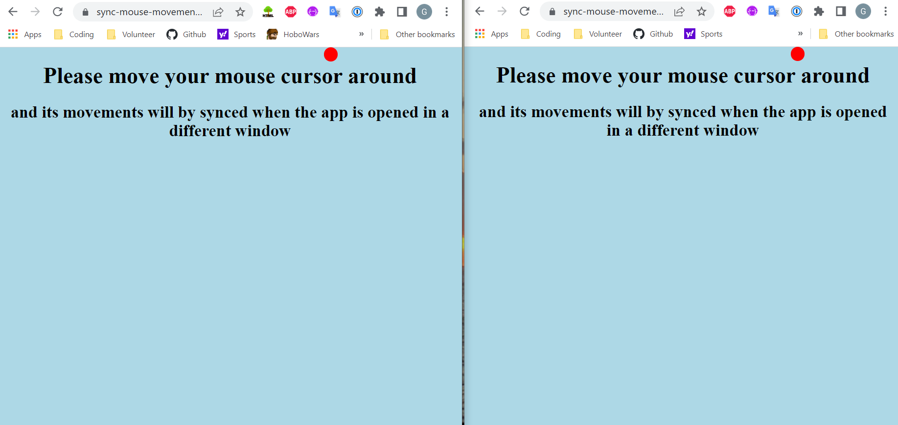
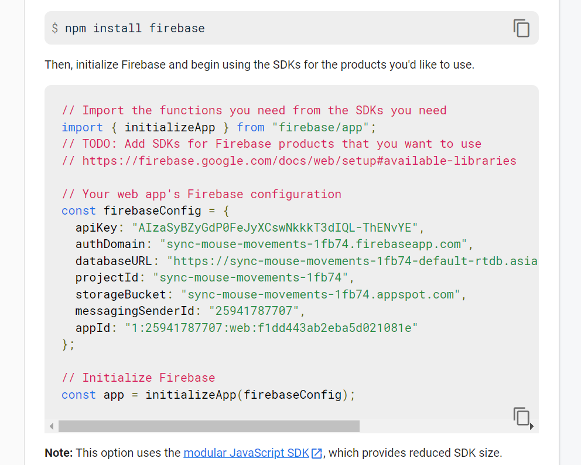

# Sync Mouse Movements

An app that will sync the mouse movements if it is open in 2 different browser windows.

Try it out: [Sync Mouse Movements](https://sync-mouse-movements-1fb74.web.app)
<br /> 
<br /> 

## Here are some pictures of the app:

<strong>Mouse cursor is synced in both browser windows</strong>


<br /> 
<br />

## Here's a video of the synchronized mouse movements in both windows
<br />
<br />

https://github.com/user-attachments/assets/3d55c395-0859-4b90-ab86-349b5f26d671


<br />
<br />

## Getting Started

### Project setup

1.  Please create a new Firebase project
2.  Add a real-time database to the project
3.  In your project settings, you will find your Firebase config settings
<br /> 
<br /> 




4. Replace your Firebase config with the one in the config.js file

<br /> 


### Development Server

Start the development server on `http://localhost:5000`:


```
firebase serve
```

## Built with

- [Javascript](https://developer.mozilla.org/en/JavaScript)
- [CSS](https://developer.mozilla.org/en-US/docs/Web/CSS)
- [Firebase](https://firebase.google.com/)

## Contributing

Pull requests are welcome. For major changes, please open an issue first to discuss what you would like to change.

## License

[MIT](https://choosealicense.com/licenses/mit/)

## Security Note

This project uses public Firebase Database rules for demonstration purposes. The database access is intentionally configured to allow public read/write operations only for mouse coordinate data at the `mouse/position` path. No sensitive information is collected or stored.

## Author

Garrett Chun - [![Github][1.1]][1] [![Twitter][1.2]][2]

[1.1]: http://i.imgur.com/9I6NRUm.png
[1.2]: ./public/assets/twitter20.png
[1]: https://github.com/KapakahiCoder
[2]: http://www.twitter.com/KapakahiCoder
